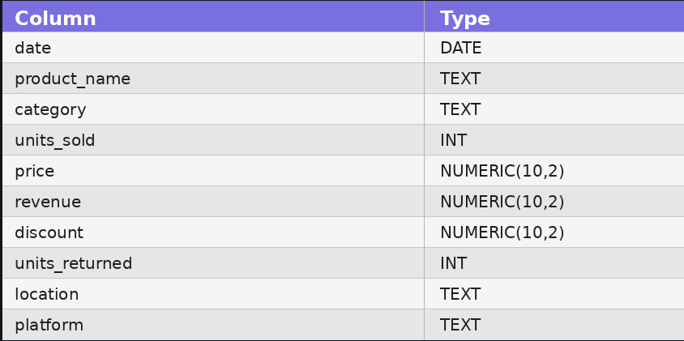
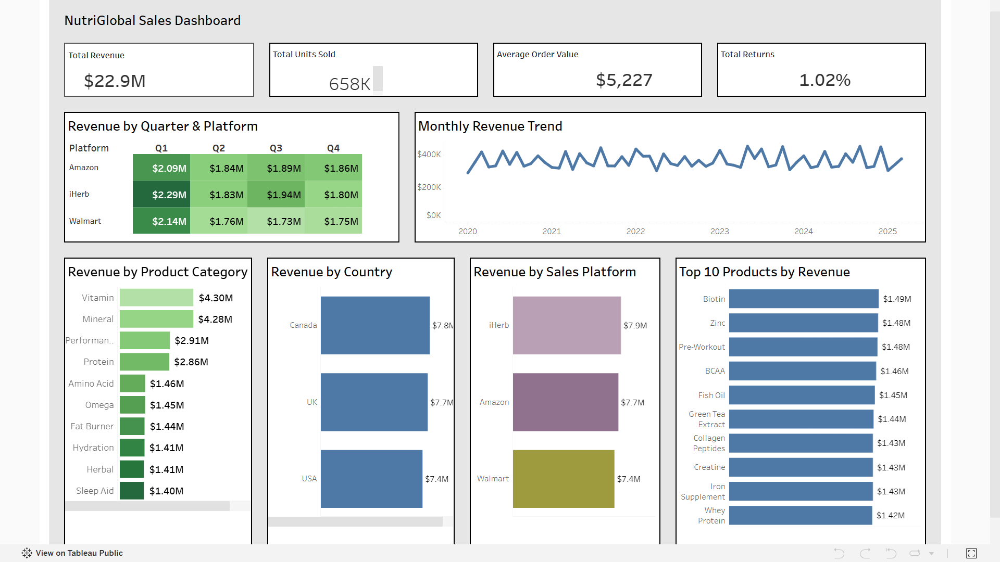
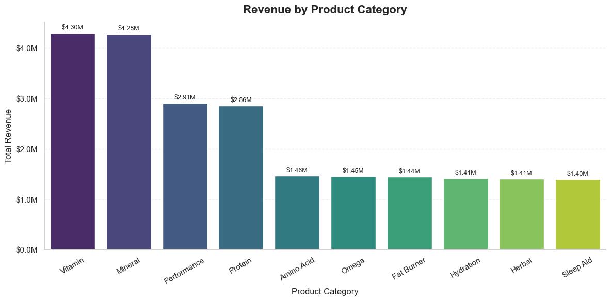
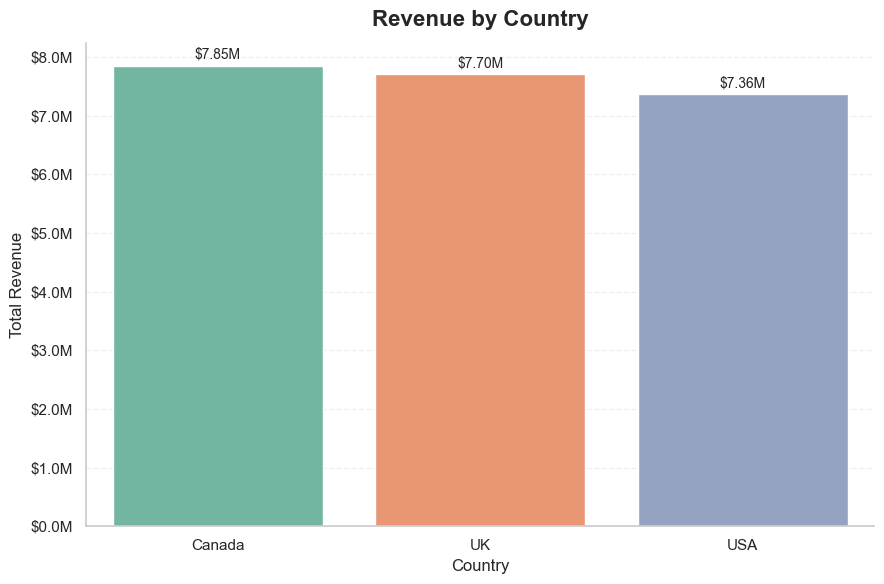
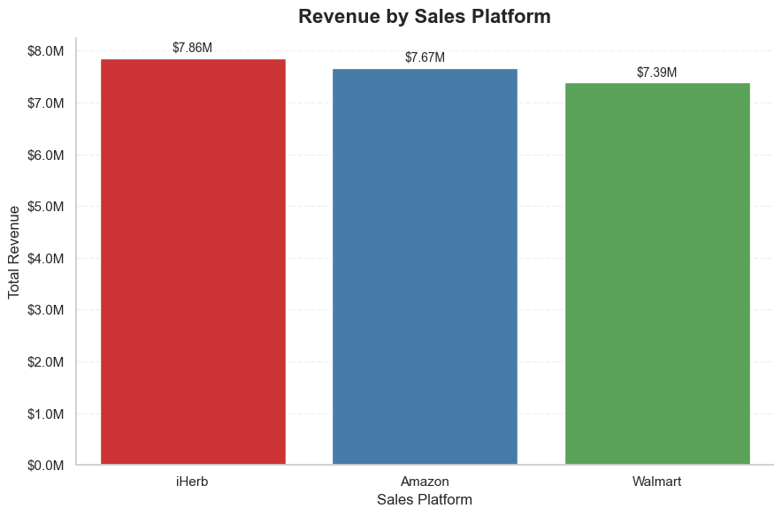
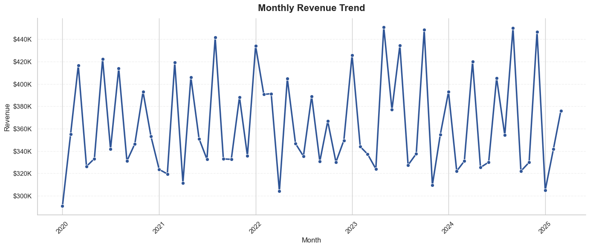

# Project Background

> **💡 This project is based on a fictional company using a real public dataset from Kaggle.**

NutriGlobal is a global health and wellness company specializing in nutritional supplements and wellness products, selling through online marketplaces and direct-to-consumer channels across multiple countries.

The company offers supplements—including proteins, vitamins, and omega products—through Amazon, Walmart, and iHerb across the USA, UK, and Canada.

Despite growing sales, management lacks clear visibility into which products, markets, and sales channels drive overall business performance and where improvement opportunities exist. This project analyzes NutriGlobal's historical sales data to uncover actionable insights and support data-driven business decision-making.

This analysis focuses on the following key business areas:

- **Sales Performance:** Evaluate overall revenue, units sold, average order value, and return rate.
- **Product Performance:** Identify top-performing product categories and products based on revenue.
- **Platform Performance:** Compare sales performance across Amazon, Walmart, and iHerb.
- **Geographic Performance:** Analyze revenue across the USA, UK, and Canada.
- **Sales Trends:** Examine monthly and quarterly sales patterns to identify business trends.

  An interactive Tableau dashboard can be viewed here.

> 🔗 **Tableau Public Dashboard:** *([here](https://public.tableau.com/app/profile/sachidananda.swain6437/viz/NutriGlobalSalesDashboard/GlobalNutritionSalesDashboard?publish=yes))*

The SQL queries used to inspect and perform data quality checks can be found [here](SQL/02_data_quality_checks.sql).

The SQL queries used to clean and prepare the dataset can be found [here](SQL/03_data_cleaning.sql).

The SQL queries used to answer key business questions can be found [here](SQL/04_business_questions.sql).

The SQL reporting views created for dashboard development can be found [here](SQL/05_reporting_views.sql).

The complete exploratory data analysis (EDA) and visualization notebook can be found [here](Python/01_sales_analysis.ipynb).

# Data Structure & Initial Checks

The analysis is based on a cleaned sales dataset containing **4,384 transaction records** of nutritional supplement sales across **three countries (USA, UK, and Canada)** from **2020 to 2025**. Each record represents a sales transaction with information on product category, sales platform, pricing, discounts, revenue, units sold, and product returns.

> **Dataset Source:** [Supplement Sales Data Dataset (Kaggle)](https://www.kaggle.com/datasets/zahidmughal2343/supplement-sales-data)

The dataset includes the following key business dimensions:

Prior to beginning the analysis, a series of SQL-based data quality checks were performed to validate data completeness, identify missing values, detect duplicate records, verify numeric ranges, and ensure consistency across business fields.

The SQL queries used to inspect and perform data quality checks can be found [here](SQL/02_data_quality_checks.sql).

# Executive Summary

This analysis examines NutriGlobal's historical sales performance from **2020 to 2025** to identify the products, sales channels, and markets contributing most to overall business performance.

Overall, NutriGlobal generated **$22.91M** in revenue from **658,478 units sold**, while maintaining a low **1.02% return rate** and an **average order value of $5,227**. Revenue remained relatively consistent throughout the analysis period, indicating stable business performance across multiple years.

Among product categories, **Vitamins** and **Minerals** generated the highest revenue, together contributing more than one-third of total sales. From a geographic perspective, **Canada** emerged as the strongest-performing market, while **iHerb** was the leading sales platform by revenue, outperforming both Amazon and Walmart.

The following dashboard summarizes the primary business metrics and performance trends explored throughout this analysis.

The remainder of this report explores these findings in greater detail, highlighting performance across products, markets, sales platforms, and time to identify opportunities for continued business growth.

# Insights Deep Dive

The following sections explore the key drivers of NutriGlobal's sales performance, focusing on product categories, geographic markets, sales platforms, and long-term sales trends. Each insight is supported by SQL analysis and visualized within the Tableau dashboard.

### Product Performance

Product category analysis shows that **Vitamins** and **Minerals** were the company's strongest revenue-generating categories, contributing approximately **$4.30M** and **$4.28M** in total revenue, respectively.

The remaining categories generated relatively balanced revenue, indicating a diversified product portfolio rather than heavy dependence on a single product segment. This balanced distribution reduces business risk while providing opportunities to further optimize high-performing categories.

   ### Geographic Performance

Among the three markets analyzed, **Canada** generated the highest total revenue at approximately **$7.85M**, outperforming both the USA and the UK.

Although sales remained relatively balanced across all three countries, Canada's stronger performance suggests higher customer demand or stronger market penetration within the region.

   ### Platform Performance

Sales performance across online marketplaces remained competitive, with **iHerb** generating approximately **$7.86M** in total revenue, making it the company's highest-performing sales platform.

Amazon and Walmart followed closely behind, demonstrating that NutriGlobal maintains a well-balanced multi-channel sales strategy rather than relying heavily on a single marketplace.

   ### Sales Trend Analysis

Monthly sales remained relatively stable throughout the analysis period, with revenue generally ranging between **$300K** and **$450K** per month.

No significant long-term decline or rapid growth trend was observed, indicating consistent customer demand across multiple years. As the dataset only contains data through the first quarter of **2025**, year-over-year comparisons for 2025 were excluded from the analysis.

   ### Top Products

Product-level analysis highlights the individual supplements contributing the highest revenue across the business. While overall category performance remained balanced, a small group of products consistently generated stronger sales than the rest of the portfolio.

Monitoring the performance of these top-selling products can help prioritize inventory planning, promotional strategies, and future product investment.

Images/
    top_10_products.png

   # Recommendations

Based on the findings from this analysis, the following recommendations could help NutriGlobal strengthen business performance and support future growth:

- **Prioritize High-Performing Product Categories:** Continue investing in Vitamins and Minerals, as they generated the highest revenue among all product categories. Expanding product offerings or promotional campaigns within these categories could further increase sales.

- **Leverage Canada's Strong Market Performance:** Since Canada was the highest-revenue market, further analysis into customer behavior, marketing effectiveness, and product preferences could help replicate this success in the USA and UK.

- **Strengthen High-Performing Sales Channels:** iHerb generated the highest revenue among all sales platforms. Understanding the factors contributing to its performance may help improve sales strategies across Amazon and Walmart.

- **Maintain a Diversified Product Portfolio:** Revenue distribution across categories remained relatively balanced, reducing reliance on a single product segment. Continuing to diversify the product portfolio can help minimize business risk while supporting long-term growth.

- **Monitor Sales Trends and Returns:** Although revenue remained stable throughout the analysis period and the return rate was low (1.02%), ongoing monitoring of sales performance and product returns will help identify emerging trends and potential operational issues early.

  # Assumptions & Caveats

Throughout this analysis, the following assumptions and limitations should be considered when interpreting the results:

- **Fictional Company:** NutriGlobal is a fictional company created for this portfolio project. The analysis is based on a real, publicly available dataset from Kaggle.

- **Dataset Scope:** The dataset contains historical sales transactions from **2020 to 2025** across the USA, UK, and Canada. Results are limited to the available data and may not represent the company's complete business operations.

- **Partial 2025 Data:** The dataset includes sales records only through the first quarter of **2025**. As a result, year-over-year comparisons involving 2025 were excluded to avoid misleading conclusions.

- **Revenue-Based Analysis:** Business performance was evaluated using revenue, units sold, average order value, and return rate. Since product cost and profit margin information were not available, profitability could not be analyzed.

- **Historical Analysis:** This project focuses on descriptive analytics using historical sales data. The findings explain past business performance and should not be interpreted as predictive forecasts.

  # Tools Used

  
  
  
  
  
  
  
  
  

